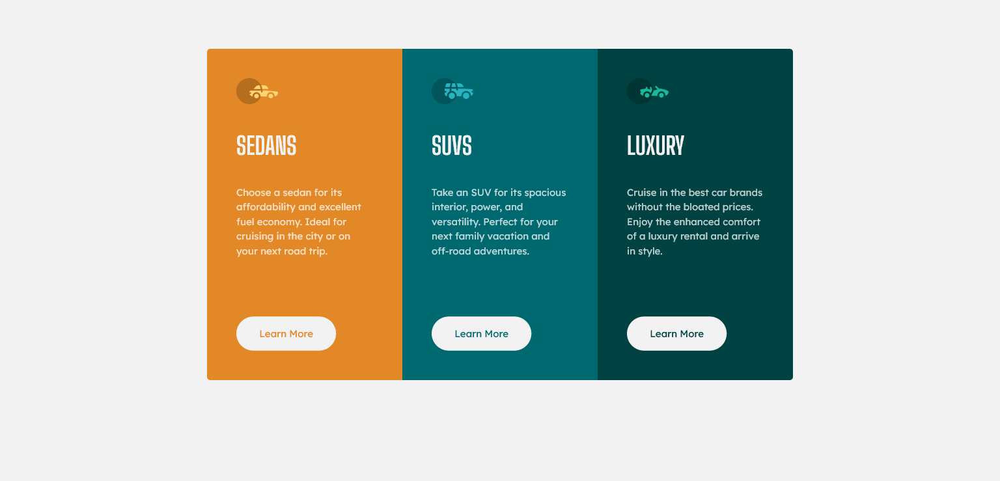
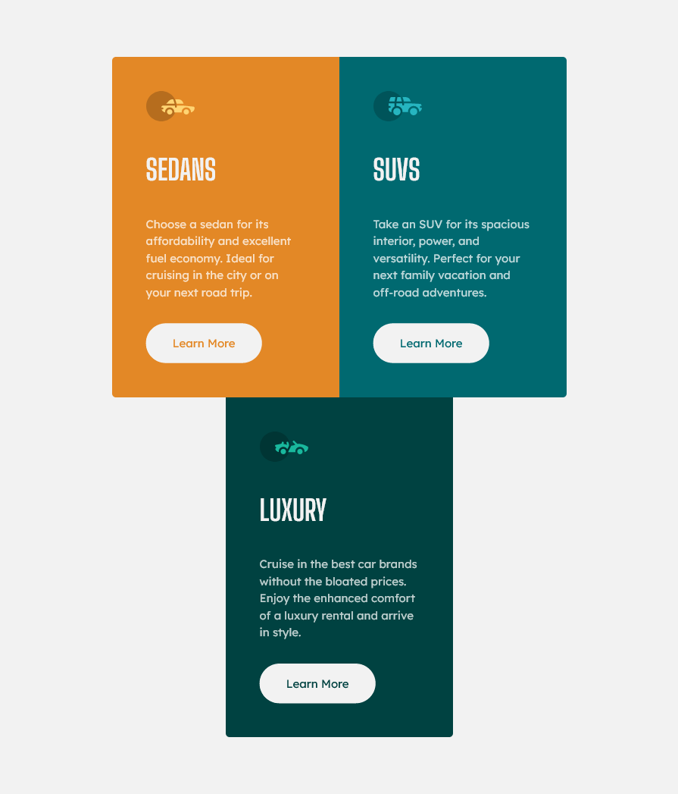

# Frontend Mentor - 3-column preview card component solution

This is a solution to the [3-column preview card component challenge on Frontend Mentor](https://www.frontendmentor.io/challenges/3column-preview-card-component-pH92eAR2-). Frontend Mentor challenges help you improve your coding skills by building realistic projects. 

## Table of contents

- [Overview](#overview)
  - [The challenge](#the-challenge)
  - [Screenshots](#screenshots)
  - [Links](#links)
  - [Built with](#built-with)
  - [What I learned](#what-i-learned)
  - [Continued development](#continued-development)
  - [Useful resources](#useful-resources)
- [Author](#author)
- [Acknowledgments](#acknowledgments)

## Overview

### The challenge

Users should be able to:

- View the optimal layout depending on their device's screen size
- See hover states for interactive elements

### Screenshots

### Links

- Solution URL: [Code Solution](https://github.com/slickLink/3-column-card-preview-component)
- Live Site URL: [live site](https://3-column-preview-card-solution.netlify.app/)

### Built with

- Semantic HTML5 markup
- SASS/ SCSS
- Flexbox
- Mobile-first workflow

**Note: These are just examples. Delete this note and replace the list above with your own choices**

### What I learned
flex-grow, flex-shrink and flex-basis
go in the flex item not container.

### Continued development

- Flexbox 
- [Ahmed Faisal](https://www.frontendmentor.io/profile/afrussel) Taught me how to reset margins and padding this was very helpful

### Useful resources

- [resource 1](https://www.linkedin.com/learning/advanced-responsive-layouts-with-css-flexbox/using-flexbox-to-create-a-grid-of-cards?u=56973065) - This helped me for better understand responsive cards

## Author

- Frontend Mentor - [@SlickLink](https://www.frontendmentor.io/profile/slickLink)

## Acknowledgments

- [Morten Rand-Hendriksen](https://www.linkedin.com/learning/instructors/morten-rand-hendriksen?u=56973065)

- [Ahmed Faisal](https://www.frontendmentor.io/profile/afrussel)